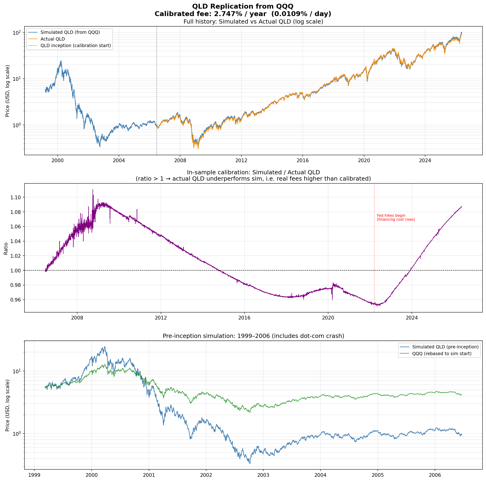

# QLD Fee Calibration

## 1. What QLD is designed to do

QLD (ProShares Ultra QQQ) targets **2× the daily return of QQQ**, minus a daily cost:

$$r_{\text{QLD}}(t) = 2\, r_{\text{QQQ}}(t) - f$$

where $f$ is the daily all-in fee (expense ratio + financing cost on the borrowed unit of leverage), assumed constant.
The cumulative price at day $T$ compounds as:

$$P_T = P_0 \prod_{t=1}^{T}\bigl(1 + 2\,r_t - f\bigr)$$

QLD was launched on **19 June 2006**, so we have ~20 years of real price history (2006-06-22 → 2026-05-22, 5,011 trading days in the calibration window) to fit $f$ against.

---

## 2. Why a constant fee is an approximation

The true daily cost has two components:

| Component | Typical magnitude | Driver |
|---|---|---|
| Expense ratio | ≈ 0.95 % / yr | Fixed (net of contractual waiver through 9/30/2026) |
| Financing cost (swap / borrow on 1 unit of leverage) | ≈ SOFR + spread | Floating |

A rough decomposition at the **calibrated fee = 2.747 % / yr**:

$$f_{\text{annual}} \approx \underbrace{0.95\%}_{\text{expense ratio}} + \underbrace{1.80\%}_{\text{financing on 1× borrow}} = 2.75\%$$

This is materially **lower than the 3.25 % / yr calibrated for TQQQ**, because TQQQ carries 2 units of borrowed exposure while QLD carries only 1. The implied per-unit financing rate is roughly:

| ETF | Leverage | Borrow units | Calibrated $f$ | Per-unit financing |
|---|---|---|---|---|
| QLD | 2× | 1 | 2.747 % / yr | ≈ 1.80 % |
| TQQQ | 3× | 2 | 3.251 % / yr | ≈ 1.15 % |

The per-unit numbers are not identical (TQQQ's appears cheaper) — partly because TQQQ's calibration window is shorter and skewed by the high-rate 2022–2024 environment, and partly because counterparty mix and swap-spread terms differ. They are however the right order of magnitude given short-term funding rates of ~1–2 % across most of 2010–2021.

Assuming constant $f$ is accurate when short-term rates are stable; it breaks down when SOFR moves sharply (2022–2024).

---

## 3. Calibration objective

We observe actual QLD from its inception (June 2006).
For a candidate fee $f$, simulate the cumulative index on QQQ returns over the same window and compare to actual QLD at every point in time.

**Loss function** — mean squared log-ratio across all $T$ overlapping trading days:

$$\mathcal{L}(f) = \frac{1}{T}\sum_{t=1}^{T} \left[\ln\!\left(\frac{\text{Sim}_t}{\text{Actual}_t}\right)\right]^2$$

Using the log-ratio (rather than a price difference) keeps the objective scale-invariant: a 5 % divergence early in the period counts the same as a 5 % divergence late, regardless of the absolute price level.

Since $\text{Sim}_t$ starts rebased to match $\text{Actual}_{t_0}$, at the correct fee the ratio should stay close to 1 everywhere, so $\ln(\cdot) \approx 0$.

**Minimisation** uses Brent's method (bounded scalar search):

$$\hat{f} = \arg\min_{f \,\in\, [-0.1\%,\, 0.2\%]\text{ /day}} \mathcal{L}(f)$$

---

## 4. Result

| Quantity | Value |
|---|---|
| Calibration window | 2006-06-22 → 2026-05-22 (5,011 trading days) |
| Calibrated daily fee $\hat{f}$ | **0.01090 % / day** |
| Implied annual fee $\hat{f} \times 252$ | **2.747 % / year** |
| In-sample annualised tracking error | 4.008 % |
| Cumulative log-drift (end of period) | +8.39 % (sim > actual) |

The positive end-of-period drift means the simulated series ran ahead of actual QLD over 2006–2026 by about 8.4 % in log terms. The bulk of that drift appears post-2022, for the same reason as TQQQ: the Fed lifted SOFR from 0 % to 5.3 %, raising real financing cost above the constant we fit.

The annualised tracking error (~4 %) is higher than TQQQ's (~2.8 %), driven mostly by intraday discrepancies between the index print and QLD's swap-marked NAV — magnified by the longer 20-year window we are fitting over (which spans multiple distinct rate regimes).

A more accurate model would make $f$ time-varying:

$$f(t) = \frac{\text{Expense ratio}}{252} + \text{SOFR}(t) \times \text{borrow units}$$

but the constant approximation is sufficient for the pre-2006 simulation we use it for, where short rates were also relatively stable.

---

## 5. Simulation back to QQQ inception (1999)

Once $\hat{f}$ is known, the synthetic QLD price series extends back to March 1999 using only QQQ daily returns:

$$\tilde{P}_t = \tilde{P}_{t_0} \cdot \prod_{s=t_0+1}^{t}\bigl(1 + 2\,r_{\text{QQQ}}(s) - \hat{f}\bigr)$$

where $\tilde{P}_{t_0}$ is anchored to the actual QLD close on its first day of trading (19 June 2006, adjusted to its first observable trading session 2006-06-22 after our `pct_change().dropna()`).

The pre-inception simulation captures one major stress period absent from real QLD history:

| Period | Simulated QLD total return | Simulated QLD max drawdown |
|---|---|---|
| Dot-com crash (Mar 2000 – Oct 2002) | **−97.6 %** | **−98.6 %** |

The dot-com number is the canonical illustration of the 2× LETF risk in a sustained bear market: even though the Nasdaq-100 itself fell ~83 % over the same window, daily-reset volatility decay compounds those losses to near-total wipeout. This is significantly less severe than TQQQ's simulated −99.9 % over the same period but still essentially terminal for a buy-and-hold position.

### Real-history calendar-year sanity checks

Comparing the simulated series's calendar-year returns (1999-2026) to the figures cited in the QLD investor's guide for the real history:

| Year | Simulated | Reported (guide) | Note |
|---|---|---|---|
| 2008 | −70.95 % | −72.89 % | within 2 pp |
| 2009 | +100.71 % | +121.20 % | sim ~20 pp light — path effects from the March 2009 V-bottom |
| 2017 | +66.44 % | +70.34 % | within 4 pp |
| 2020 | +81.72 % | +88.90 % | sim 7 pp light — COVID V-bottom path |
| 2022 | −60.89 % | −60.52 % | exact |
| 2023 | +129.15 % | +117.13 % | sim 12 pp heavy — low-vol uptrend favoured the constant-fee model |
| 2024 | +53.71 % | +42.81 % | sim 11 pp heavy |

The simulation is good enough for regime-level comparison but should not be used to compute precise individual-year returns — actual QLD's compounding depends on the realised intraday path, while the simulation only sees close-to-close QQQ returns and a constant fee.

---

## 6. Volatility decay (the hidden cost of leverage)

Even with $f = 0$, a 2× ETF underperforms 2× the buy-and-hold return of the underlying.
For a single up/down cycle of size $r$:

$$\text{Leveraged}: (1+2r)(1-2r) = 1 - 4r^2 < 1$$

Over $T$ days with daily variance $\sigma^2$, the log-return of the leveraged ETF is approximately:

$$\ln P_T \approx 2\,\ln\!\left(\frac{\text{QQQ}_T}{\text{QQQ}_0}\right) - \frac{4\,\sigma^2 T}{2} - f\,T = 2\,\ln\!\left(\frac{\text{QQQ}_T}{\text{QQQ}_0}\right) - 2\sigma^2 T - f\,T$$

The volatility-drag term scales as **$k(k-1)\sigma^2/2$** in leverage $k$ — so QLD's drag is $2\sigma^2$ per day vs TQQQ's $9\sigma^2/2 = 4.5\sigma^2$ per day. That 2.25× difference in drag is the structural reason QLD survives high-volatility regimes that TQQQ does not, and is why community simulations consistently identify the **2× – 2.5× region as the long-term optimum** on the Nasdaq-100.

---

## 7. Outputs

| File | Contents |
|---|---|
| `scripts/qld_replication.py` | Calibration + simulation script |
| `data/qld_simulated.csv` | Date, QQQ, QLD_actual (NaN before 2006-06-22), QLD_simulated — 1999-03-10 → today |
| `figures/qld_replication.png` | 3-panel: sim vs actual (log), in-sample ratio, pre-inception extension |
| `docs/QLD_CALIBRATION.md` | This document |
