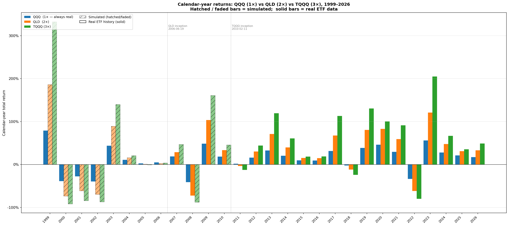
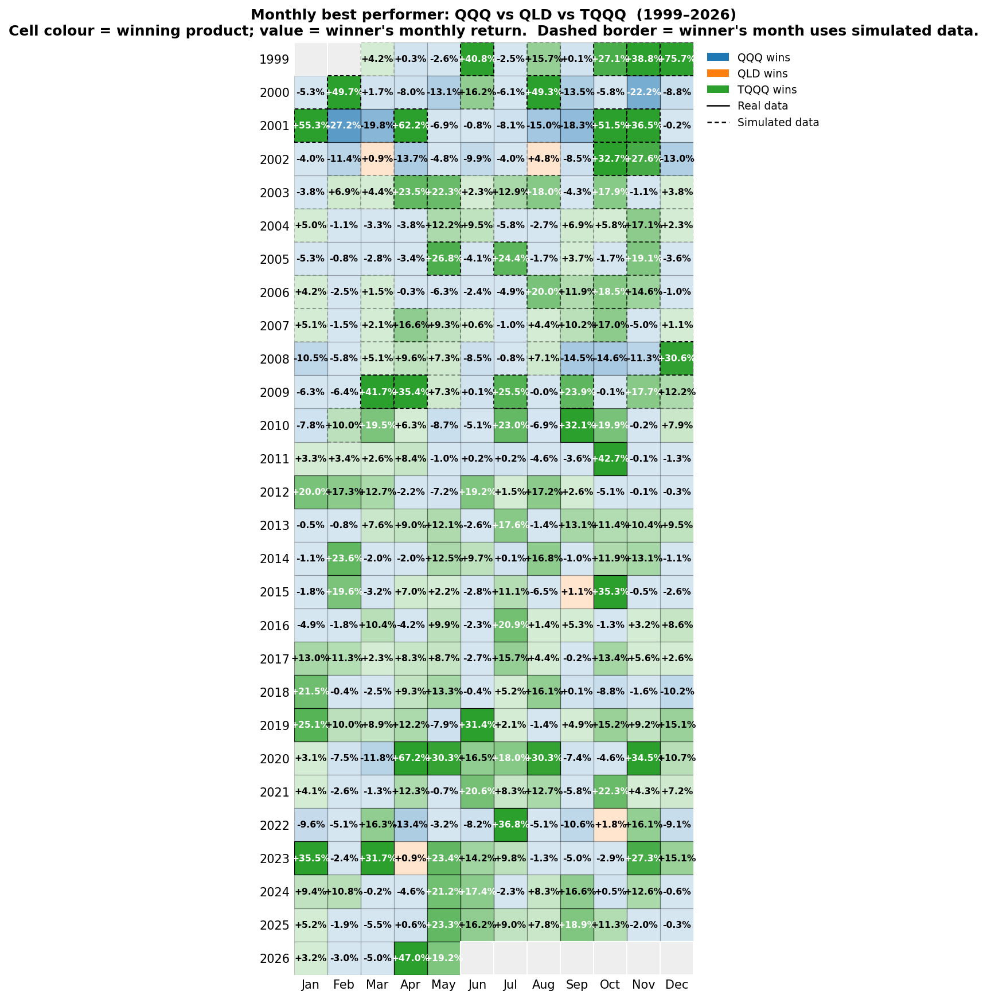

# QLD Returns Comparison — QQQ vs QLD vs TQQQ

Three-way comparison of calendar-year and monthly returns for the 1×/2×/3× Nasdaq-100 ETFs over the period **Mar 1999 → today**. QQQ is real history throughout; QLD is stitched (simulated 1999 → 2006-06-19, real after); TQQQ is stitched (simulated 1999 → 2010-02-11, real after). Methodology and calibration details: see [QLD_CALIBRATION.md](QLD_CALIBRATION.md).

Source script: [`scripts/qld_returns_comparison.py`](../scripts/qld_returns_comparison.py).

---

## 1. Calendar-year returns

Grouped bars per year; hatched/faded bars are simulated, solid bars are real ETF data. Two vertical reference lines mark QLD and TQQQ inceptions.

**Reading.**

- **Bear years scale near-linearly with leverage.** 2000 (−36 % / −74 % / −95 % sim), 2008 (−42 % / −71 % / −89 % sim), and 2022 (−33 % / −61 % / −80 % real) all roughly track the kx multiple after fee.
- **Strong-trend bull years can exceed the leverage multiple** when realised volatility is low — 2009, 2017, 2019, 2020, 2023 show QLD beating 2× and TQQQ beating 3× QQQ's return ("positive leverage alpha").
- **Choppy years underperform the leverage multiple** — 2011, 2018 are textbook volatility-decay cases where 2× lost more than 2× and 3× lost more than 3× the index's loss.

## 2. Monthly best performer (1999–2026)

For every month, the bar with the highest total return wins. Cell colour shows the winning product; the number is the winner's return. Dashed cell borders indicate the winning product's monthly return is computed from simulated data.

**Reading.** The cell colours form a near-binary indicator of the month's sign — TQQQ green in essentially every up month, QQQ blue in essentially every down month. QLD wins almost nothing because in a positive month the highest-leverage product wins and in a negative month the lowest-leverage product loses least; QLD is sandwiched between the two and only wins in the narrow band where intra-month chop is enough to drag TQQQ below QLD while QLD still beats QQQ on the close-to-close.

### Winner counts

| Product | Months won | % of 327 |
|---|---:|---:|
| QQQ  | 147 | 45.0 % |
| QLD  |   5 |  1.5 % |
| TQQQ | 175 | 53.5 % |

| Month sign | QQQ wins | QLD wins | TQQQ wins |
|---|---:|---:|---:|
| Positive (190 months) |  10 | 5 | 175 |
| Negative (137 months) | 137 | 0 |   0 |

| Slice | QQQ | QLD | TQQQ |
|---|---:|---:|---:|
| 1999-Mar → 2006-Jun (QLD sim, TQQQ sim) | 49 | 2 |  37 |
| 2006-Jun → 2010-Feb (QLD real, TQQQ sim) | 18 | 0 |  25 |
| 2010-Feb → today    (QLD real, TQQQ real) | 80 | 3 | 113 |

The five QLD-winning months in full (re-runnable via [`scripts/heatmap_breakdown.py`](../scripts/heatmap_breakdown.py)):

| Month | QQQ | QLD | TQQQ | Source |
|---|---:|---:|---:|---|
| 2002-03 | +0.90 % | +0.92 % | +0.46 % | sim |
| 2002-08 | +3.34 % | +4.78 % | +4.68 % | sim |
| 2015-09 | +0.95 % | +1.06 % | +1.03 % | real |
| 2022-10 | +1.62 % | +1.80 % | +1.40 % | real |
| 2023-04 | +0.75 % | +0.85 % | +0.68 % | real |

Every one is a positive close-to-close month with enough intra-month chop that TQQQ's compounded daily return slips below QLD's. QLD never wins a negative month, and never wins a positive month with a clean trend — TQQQ takes all of those.

---

## 3. Outputs

| File | Contents |
|---|---|
| `scripts/qld_returns_comparison.py` | Generates both plots |
| `scripts/heatmap_breakdown.py` | Re-runs the winner counts above |
| `figures/yearly_returns_bar.png` | §1 calendar-year bar chart |
| `figures/monthly_best_heatmap.png` | §2 monthly best-performer heatmap |
| `docs/QLD_RETURNS_COMPARISON.md` | This document |
