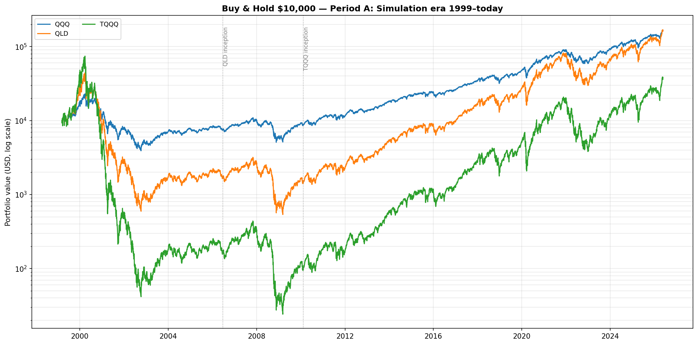
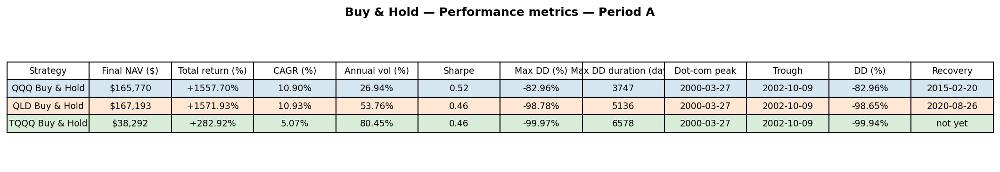
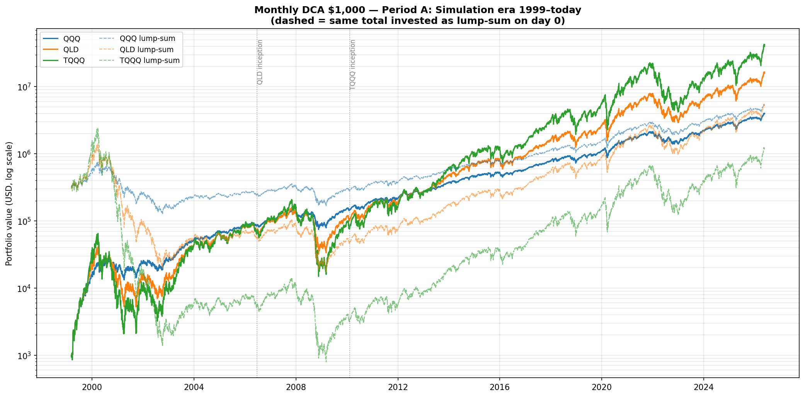
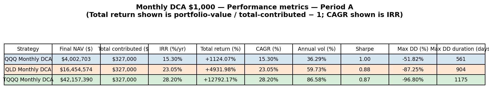
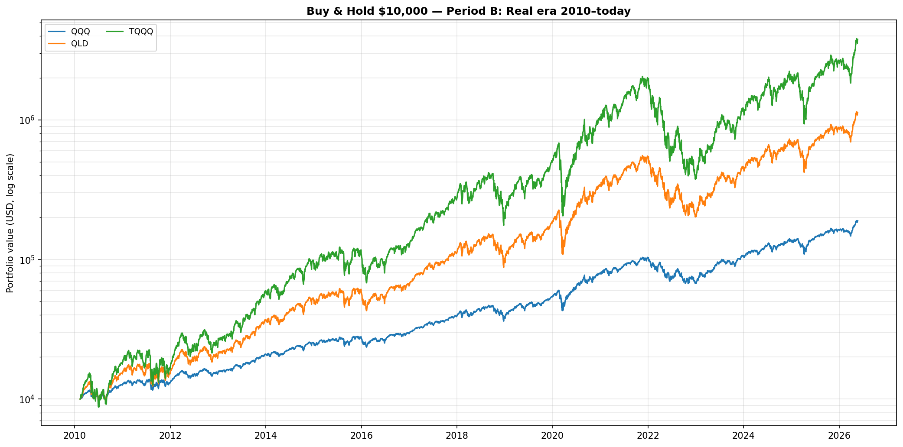
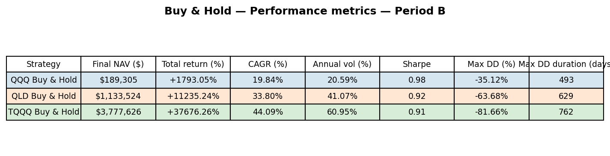
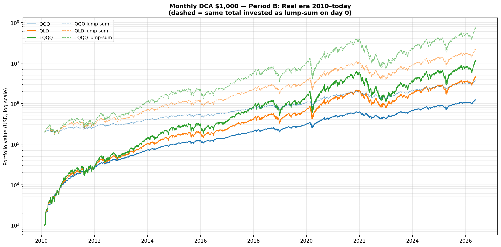
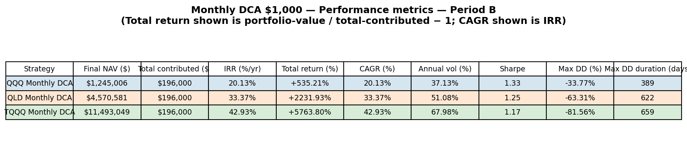

# QLD Long-Hold Strategy Report

Two long-only allocation strategies tested across three products (QQQ 1×, QLD 2×, TQQQ 3×) and two evaluation windows.

## 1. Background

QLD targets 2× the daily return of QQQ. Over time it pays:

- **Expense ratio** ≈ 0.95 %/yr (net of contractual waiver).
- **Implied swap financing** on the borrowed 1× of exposure ≈ 1.80 %/yr (calibrated — see `QLD_CALIBRATION.md`).
- **Volatility drag** $\approx \sigma^2 T$ per unit time (half the drag TQQQ pays at the same QQQ vol).

The 2006-06-19 inception means QLD's real history misses the 2000 dot-com crash. We use the calibrated daily-fee model to extend the series back to QQQ inception (1999-03-10) and then run every strategy on **two datasets**:

- **Period A — Simulation era 1999-03 → today** (27 years, includes dot-com & GFC drawdowns).
- **Period B — Real era 2010-02 → today** (16 years, post-GFC bull market dominated; aligns to TQQQ inception so all three products are real).

For every (product × strategy × period) we report: final NAV, total return, CAGR, annualised volatility, Sharpe (rf = 0), max drawdown, max drawdown duration. For Period A we additionally report the dot-com peak / trough / drawdown depth / recovery date. For DCA we add total contributed and IRR.

---

## 2. Strategies

### Strategy A — Buy & Hold

- Invest **$10,000 on day 0**, hold to the final observation.
- No rebalancing; the position simply tracks the product.
- Reference benchmark for everything else.

### Strategy B — Monthly DCA

- Invest **$1,000 on the first trading day of every calendar month**, hold all units to the end.
- Naturally smooths entry price and buys more units after drawdowns.
- For context each DCA plot overlays a **lump-sum baseline** — the same total dollars contributed by DCA, but invested all on day 0 (dashed line, same colour).

---

## 3. Results — Period A (Simulated 1999 → today)

### 3.1 Buy & Hold

| Product | Final NAV | CAGR | Vol | Sharpe | Max DD | DD duration | Dot-com peak | Trough | DD depth | Recovery |
|---|---:|---:|---:|---:|---:|---:|---|---|---:|---|
| QQQ  | $165,770 | 10.90% | 26.94% | 0.52 | −82.96% | 3,747 d | 2000-03-27 | 2002-10-09 | −82.96% | 2015-02-20 |
| QLD  | $167,193 | 10.93% | 53.76% | 0.46 | −98.78% | 5,136 d | 2000-03-27 | 2002-10-09 | −98.65% | 2020-08-26 |
| TQQQ | $38,292  |  5.07% | 80.45% | 0.46 | −99.97% | 6,578 d | 2000-03-27 | 2002-10-09 | −99.94% | **not yet** |

**Reading.** Over the full 27-year window, **QLD's CAGR (10.93 %) is statistically indistinguishable from QQQ's (10.90 %) — despite carrying 2× exposure** — because the dot-com pathology wiped 99 % of capital and it took until **2020-08-26** (20 years!) to recover. TQQQ buy-and-hold over 1999-2026 is *worse than QQQ* (5.07 % CAGR) and the dot-com peak set on 2000-03-27 has not been reached again as of 2026.

The numbers are simulation-based for the pre-2006/pre-2010 portion; the qualitative point ("leveraged buy-and-hold over a window containing dot-com is a near-disaster") is robust, but the precise wipeout depth (−98.65 % for QLD, −99.94 % for TQQQ) is a function of the constant-fee simulation and assumes the funds would have been allowed to continue trading. In reality LETFs face exchange-level halts and counterparty actions that the model does not capture.

### 3.2 Monthly DCA

| Product | Final NAV | Total contributed | IRR (=CAGR) | Vol | Sharpe | Max DD | DD duration |
|---|---:|---:|---:|---:|---:|---:|---:|
| QQQ  | $4,002,703  | $327,000 | 15.30% | 36.29% | 1.00 | −51.82% | 561 d |
| QLD  | $16,454,579 | $327,000 | 23.05% | 59.73% | 0.88 | −87.25% | 904 d |
| TQQQ | $42,157,390 | $327,000 | 28.20% | 86.58% | 0.87 | −96.80% | 1,175 d |

**Reading.** DCA inverts the BAH conclusion. Spreading contributions over 27 years means most of the dollar-weighted exposure was added *after* the dot-com bottom, so the leveraged products avoid the early wipeout. **QLD's DCA IRR (23.0 %) far outperforms QQQ's (15.3 %)** and TQQQ's DCA IRR (28.2 %) is best of all — at the cost of an 87-97 % max NAV drawdown along the way. Sharpe still favours QQQ (1.00 vs 0.88 vs 0.87) because the leveraged products' volatility scales nearly with leverage.

---

## 4. Results — Period B (Real 2010 → today)

### 4.1 Buy & Hold

| Product | Final NAV | CAGR | Vol | Sharpe | Max DD | DD duration |
|---|---:|---:|---:|---:|---:|---:|
| QQQ  | $189,305    | 19.84% | 20.59% | 0.98 | −35.12% | 493 d |
| QLD  | $1,133,523  | 33.80% | 41.07% | 0.92 | −63.68% | 629 d |
| TQQQ | $3,777,627  | 44.09% | 60.95% | 0.91 | −81.66% | 762 d |

(See `strategy_metrics.csv` for the full-precision values.)

**Reading.** Over the post-GFC era — which is exactly the regime the guide flagged as "*not guaranteed to repeat*" — leverage paid off cleanly. QLD nearly tripled QQQ's CAGR; TQQQ more than doubled it again. Max drawdowns still scaled roughly linearly with leverage (35 → 64 → 82 %), but every product fully recovered within the period. **QLD's Sharpe (0.92) is close to QQQ's (0.98)**, which is the strongest single argument the community makes for 2× over 1× during a bull regime.

### 4.2 Monthly DCA

| Product | Final NAV | Total contributed | IRR (=CAGR) | Vol | Sharpe | Max DD | DD duration |
|---|---:|---:|---:|---:|---:|---:|---:|
| QQQ  | $1,245,006   | $196,000 | 20.13% | 37.13% | 1.33 | −33.77% | 389 d |
| QLD  | $4,570,581   | $196,000 | 33.37% | 51.08% | 1.25 | −63.31% | 622 d |
| TQQQ | $11,493,049  | $196,000 | 42.93% | 67.98% | 1.17 | −81.56% | 659 d |

**Reading.** Over this window, **DCA's lump-sum baseline beats DCA itself** for all three products (lump-sum has more time in market in a bull regime). The leveraged products produce eye-popping terminal values from $196k contributed, but the Sharpe-weighted improvement over QQQ is small (1.33 → 1.25 → 1.17): the dollar wins are concentrated in the high-vol tail.

---

## 5. Period A vs Period B — head-to-head

| Metric (BAH) | QQQ A | QQQ B | QLD A | QLD B | TQQQ A | TQQQ B |
|---|---:|---:|---:|---:|---:|---:|
| CAGR | 10.90% | 19.84% | 10.93% | 33.80% | 5.07% | 44.09% |
| Max DD | −82.96% | −35.12% | −98.78% | −63.68% | −99.97% | −81.66% |
| Sharpe | 0.52 | 0.98 | 0.46 | 0.92 | 0.46 | 0.91 |

The CAGR gap between Period A and Period B for the leveraged products is the single biggest takeaway: **including the dot-com era turns 2× and 3× buy-and-hold into capital destroyers**. Without dot-com, they are spectacular winners. Any forward-looking allocation has to account for the possibility — not certainty — that a dot-com-like episode recurs.

---

## 6. Caveats

- Period A QLD/TQQQ figures use simulated prices pre-inception (QLD pre-2006-06-19, TQQQ pre-2010-02-11). The simulation uses a constant daily fee calibrated on the in-sample period (see `QLD_CALIBRATION.md`); it does not capture intraday vol effects or rate-driven changes in financing cost.
- The dot-com simulated drawdowns (−98.7 % for QLD, −99.9 % for TQQQ) assume the funds would have been allowed to continue trading. In reality, an LETF approaching −99 % would face exchange halts, counterparty defaults, and forced reverse splits — the linear simulation does not model any of those.
- Sharpe uses rf = 0; using a short T-bill curve would slightly compress all values but not change the relative ordering between products.
- IRR for the DCA strategies is annualised from monthly cash flows via Brent's root-find on NPV = 0; it equals the money-weighted CAGR.
- All metrics use close-to-close daily data; transaction costs, taxes, and bid-ask spreads are excluded. Real DCA in a taxable account would underperform these figures.
- The Period B "real" series for QLD and TQQQ are from yfinance's auto-adjusted close, which folds in all dividends and splits.

---

## 7. Analysis notes

### 7.A — Monthly heatmap: winner breakdown

Counts from `_heatmap_breakdown.py` over the 327 months Mar 1999 → May 2026:

| Product | Months won | % of total |
|---|---:|---:|
| QQQ  | 147 | 45.0 % |
| QLD  |   5 |  1.5 % |
| TQQQ | 175 | 53.5 % |

The result is essentially a binary indicator of the market's monthly sign, not a feature of QLD:

| Month sign | QQQ wins | QLD wins | TQQQ wins |
|---|---:|---:|---:|
| Positive (190 months) |  10 | 5 | 175 |
| Negative (137 months) | 137 | 0 |   0 |

In a positive month, 3× leverage usually wins (TQQQ); in a negative month, 1× always wins (QQQ loses the least). QLD is sandwiched: it can only win in the rare positive months where intra-month volatility decay punishes 3× more than 2× **while** 2× still beats 1×.

By data-source slice (sim / real boundaries):

| Slice | QQQ | QLD | TQQQ |
|---|---:|---:|---:|
| 1999-Mar → 2006-Jun (QLD sim, TQQQ sim)      | 49 | 2 |  37 |
| 2006-Jun → 2010-Feb (QLD real, TQQQ sim)    | 18 | 0 |  25 |
| 2010-Feb → today    (QLD real, TQQQ real)    | 80 | 3 | 113 |

The five QLD-winning months in full:

| Month | QQQ | QLD | TQQQ | Source |
|---|---:|---:|---:|---|
| 2002-03 | +0.90 % | +0.92 % | +0.46 % | sim |
| 2002-08 | +3.34 % | +4.78 % | +4.68 % | sim |
| 2015-09 | +0.95 % | +1.06 % | +1.03 % | real |
| 2022-10 | +1.62 % | +1.80 % | +1.40 % | real |
| 2023-04 | +0.75 % | +0.85 % | +0.68 % | real |

Every one is a positive close-to-close month with enough intra-month chop that TQQQ's compounded daily return slips below QLD's. QLD never wins a negative month, and never wins a positive month with a clean trend — TQQQ takes all of those.

### 7.B — DCA accounting: how Total return and IRR are computed

**Mechanic.** On the first trading day of each calendar month we buy `$1,000 / price_t` units; we never sell. Portfolio value on any day t equals (cumulative units bought through t) × price_t. Code: `qld_strategies.py:monthly_dca`.

| Column in the DCA metrics table | Formula | What it answers |
|---|---|---|
| **Total contributed ($)** | $1,000 × (number of monthly contributions) | "How much new money did I put in?" |
| **Final NAV ($)** | last day's portfolio value (units × price) | "What is the portfolio worth at the end?" |
| **Total return (%)** | `Final_NAV / Total_contributed − 1` (MOIC − 1) | Simple money-on-money multiple. **Not time-weighted**, so it is *not* comparable to the BAH "Total return" — later contributions had less time to compound. Just: "how many dollars did I end up with relative to what I put in?" |
| **IRR (%/yr)** | the annualised rate $r$ solving $\sum_i cf_i / (1+r)^{t_i} = 0$, where each contribution is a negative cash flow on its date and the final portfolio value is a positive cash flow on the last day, $t_i$ in years from the first contribution. Solved via `scipy.optimize.brentq` over $[-0.99, 5.0]$ in `qld_strategies.py:irr_monthly`. | The money-weighted annualised return — the correct cross-strategy comparison metric since it accounts for *when* each dollar went in. |
| **CAGR (%)** | set equal to IRR for consistency | DCA has no single "initial investment" so a price-only CAGR is undefined; the money-weighted IRR plays the same role. |

Worked example, Period B QLD DCA:

- 196 monthly contributions × $1,000 = **$196,000 contributed**.
- Final portfolio value on 2026-05-22 = **$4,570,581**.
- Total return = 4,570,581 / 196,000 − 1 = **+2,231.9 %** (the "+2197.36 %" you may see is from the prior data snapshot; current is +2231.9 %).
- IRR is the annualised rate that makes the 196 outflows + 1 inflow NPV to zero — solved to **33.37 %/yr**.

The IRR being *lower* than the BAH CAGR (33.80 %) over the same window is normal: DCA dollars-weight later (smaller-time-in-market) contributions equally with the early ones, while BAH gives the whole 16.3 years of compounding to the single initial deposit.

### 7.C — What "Max DD duration (days)" means

Defined in `qld_strategies.py:perf_metrics` as the **longest consecutive run of trading days where NAV is strictly below the running peak NAV**. In words: the longest "underwater" stretch over the entire backtest — *not* necessarily the duration of the *deepest* drawdown specifically (though in our results the two coincide because the deepest drawdown also took longest to recover).

- Units are **trading days** (≈ 252 / yr), not calendar days.
- Example: QQQ Buy & Hold Period A is **3,747 trading days ≈ 14.9 years**, matching the dot-com peak (2000-03-27) → recovery (2015-02-20) entries in the same row.
- If a strategy never returns to its prior peak, the count runs to the end of the data — that is the trailing underwater streak length. **TQQQ Buy & Hold Period A's 6,578 days** is exactly this case (the 2000-03-27 peak has not been reclaimed as of 2026; the "Recovery" column reads "not yet").

---

## 8. Files

| File | Contents |
|---|---|
| `scripts/qld_strategies.py` | Backtest engine + plot/table emitters |
| `figures/bah_nav_period{A,B}.png` | Buy & Hold NAV curves |
| `figures/dca_nav_period{A,B}.png` | Monthly DCA NAV curves (with lump-sum baselines) |
| `figures/bah_metrics_period{A,B}.png` | Buy & Hold performance tables |
| `figures/dca_metrics_period{A,B}.png` | DCA performance tables |
| `data/strategy_metrics.csv` | All metrics in one machine-readable table |
| `scripts/heatmap_breakdown.py` | Re-runs §7.A counts from `data/qld_simulated.csv` + live TQQQ |
| `docs/QLD_STRATEGY_REPORT.md` | This document |
