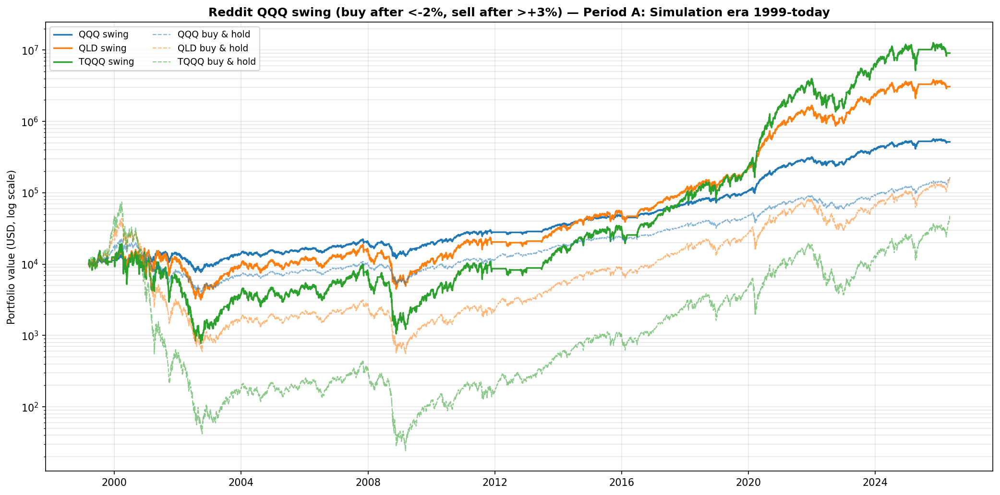
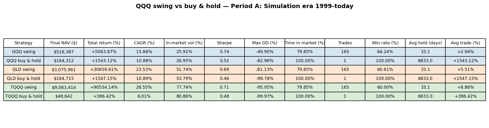
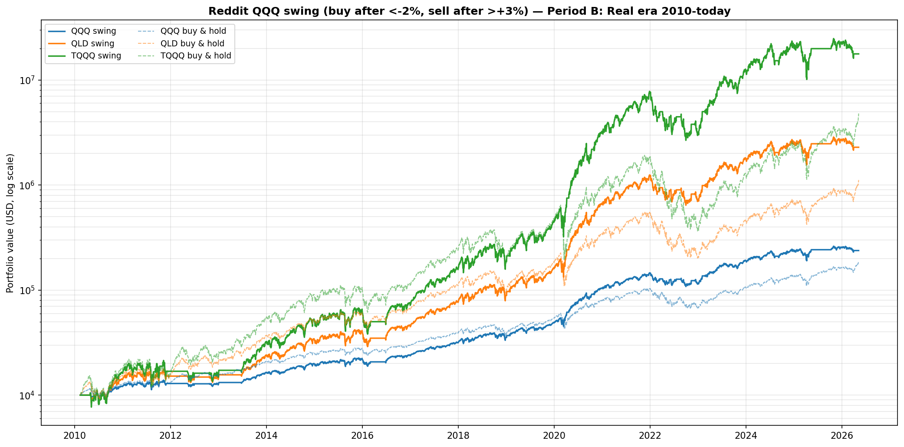
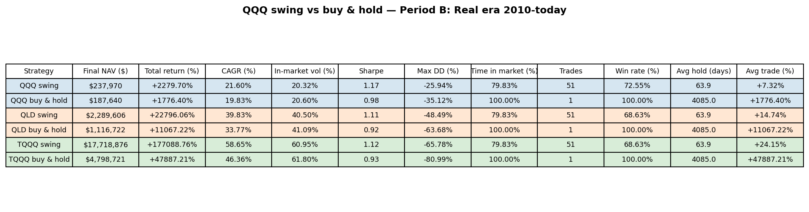

# Reddit QQQ Swing-Strategy Backtest

A backtest of the "buy-the-dip / sell-the-rip" swing strategy that circulates on Reddit, applied to QQQ (1×) and its leveraged cousins QLD (2×) and TQQQ (3×), plus a detailed check of whether the strategy is **active right now (June 2026)**.

## 1. The strategy

As described on Reddit:

- **ENTRY** — when the **previous day's QQQ close-to-close return is below −2 %**, buy.
- **EXIT**  — keep holding until the **previous day's QQQ return is above +3 %**, then sell.
- In between, you are either fully invested (1 unit of the asset) or fully in cash.

The trade signal is **always derived from QQQ's daily return**, even when the asset you buy is QLD or TQQQ — those are simply leveraged expressions of the same Nasdaq-100 bet. Because the position held on day *T* is decided entirely from the return realised on day *T−1*, every trade is a next-day execution and the backtest contains **no look-ahead**.

This is a contrarian mean-reversion rule: it forces you into the market *after* a sharp down-day and forces you out *after* a sharp up-day. In practice that means you sit out the calm stretches that follow a blow-off +3 % spike, and you climb aboard during turbulent, news-driven selloffs.

## 2. Methodology & data

| Item | Choice |
|---|---|
| Signal | QQQ daily close-to-close return; enter < −2 %, exit > +3 % (prev-day) |
| Assets traded | QQQ, QLD, TQQQ (signal identical, asset differs) |
| Execution | Next-day, close-to-close; `position[T]` set from `return[T−1]` |
| Costs | None modelled (frictionless; see §6) |
| Benchmark | Buy & Hold of the same asset |
| Period A | Simulation era **1999-03-11 → 2026-05-08** (stitched simulated + real) |
| Period B | Real era **2010-02-11 → 2026-05-08** (100 % real ETF data) |

Price data is loaded by [`scripts/qqq_swing_strategy.py`](../scripts/qqq_swing_strategy.py). The script first **tries to pull the latest QQQ/QLD/TQQQ from yfinance** so the backtest runs right up to today; if the network is unavailable it falls back to the cached CSVs in [`data/`](../data/) and prints the as-of date. The numbers in this report were produced in a sandbox whose network policy blocks Yahoo Finance, so the quantitative backtest runs on cached data:

- **QQQ / QLD reliable through 2026-05-22**; the joint 3-ETF backtest is bound by a staler cached TQQQ series and ends **2026-05-08**.
- Re-run the script on a networked machine to extend every window to the current session automatically.

> The full QQQ **signal** check (§5) uses the QQQ series through 2026-05-22 — it is not held back by the staler TQQQ cache, because the entry/exit rule only needs QQQ.

## 3. Results — Period A (Simulated 1999 → today)





| Asset | Strategy | Final NAV ($10k start) | CAGR | Sharpe | Max DD | Time in mkt | Trades | Win rate | Avg hold | Avg trade |
|---|---|---:|---:|---:|---:|---:|---:|---:|---:|---:|
| QQQ  | **Swing**     | $516,387 | **15.66 %** | 0.74 | **−49.90 %** | 79.8 % | 165 | 64.2 % | 33 d | +2.94 % |
| QQQ  | Buy & Hold    | $164,312 | 10.88 % | 0.52 | −82.96 % | 100 % | 1 | — | — | — |
| QLD  | **Swing**     | $3,075,961 | **23.53 %** | 0.69 | **−81.13 %** | 79.8 % | 165 | 60.6 % | 33 d | +5.51 % |
| QLD  | Buy & Hold    | $164,715 | 10.89 % | 0.46 | −98.78 % | 100 % | 1 | — | — | — |
| TQQQ | **Swing**     | $9,063,414 | **28.55 %** | 0.71 | **−95.95 %** | 79.8 % | 165 | 60.0 % | 33 d | +8.86 % |
| TQQQ | Buy & Hold    | $48,642 | 6.01 % | 0.48 | −99.97 % | 100 % | 1 | — | — | — |

**Read-out.** Across the full 27-year window the swing rule beats Buy & Hold on **every** metric for every asset — higher CAGR, higher Sharpe, and materially shallower drawdowns. The effect is dramatic for the leveraged products: it is precisely the dot-com and GFC crashes (where 2×/3× Buy & Hold lost 98–99 %+ and took up to 20 years to recover) that the dip/rip rule sidesteps by being in cash for ~20 % of the time. TQQQ swing turns into a $9 M outcome where TQQQ Buy & Hold ($48k) never recovers its 2000 peak. **Caveat:** the pre-2010 leveraged figures are simulated and assume frictionless trading through arbitrary drawdowns — treat them as illustration, not a literal counterfactual (see §6).

## 4. Results — Period B (Real 2010 → today)





| Asset | Strategy | Final NAV ($10k start) | CAGR | Sharpe | Max DD | Time in mkt | Trades | Win rate | Avg hold | Avg trade |
|---|---|---:|---:|---:|---:|---:|---:|---:|---:|---:|
| QQQ  | **Swing**     | $237,970 | **21.60 %** | **1.17** | **−25.94 %** | 79.8 % | 51 | 72.5 % | 64 d | +7.32 % |
| QQQ  | Buy & Hold    | $187,640 | 19.83 % | 0.98 | −35.12 % | 100 % | 1 | — | — | — |
| QLD  | **Swing**     | $2,289,606 | **39.83 %** | **1.11** | **−48.49 %** | 79.8 % | 51 | 68.6 % | 64 d | +14.74 % |
| QLD  | Buy & Hold    | $1,116,722 | 33.77 % | 0.92 | −63.68 % | 100 % | 1 | — | — | — |
| TQQQ | **Swing**     | $17,718,876 | **58.65 %** | **1.12** | **−65.78 %** | 79.8 % | 51 | 68.6 % | 64 d | +24.15 % |
| TQQQ | Buy & Hold    | $4,798,721 | 46.36 % | 0.93 | −80.99 % | 100 % | 1 | — | — | — |

**Read-out.** Even in the clean post-GFC bull market — the regime most hostile to a sit-in-cash rule — the swing strategy still adds ~2–6 CAGR points and lifts Sharpe from ~0.9–1.0 to ~1.1–1.2 while cutting max drawdown by roughly a quarter. The edge is smaller than in Period A because there were no multi-year crashes to dodge, but it is consistent: dodging the worst single-day clusters (Aug 2015, Dec 2018, Mar 2020, 2022) more than pays for the up-days missed.

## 5. Does it apply *this month*? (live-state check)

The script's `current_month_check()` reconstructs the exact entry/exit state from the QQQ return series. Using cached QQQ data through **2026-05-22** plus web-sourced June closes (see below):

| Question | Answer |
|---|---|
| Position state on the last in-data session (2026-05-22) | **FLAT — in cash** |
| Most recent ENTRY trigger (QQQ day < −2 %) | **2026-03-26** (−2.39 %) → would buy 2026-03-27 |
| Most recent EXIT trigger (QQQ day > +3 %) | **2026-03-31** (+3.39 %) → would sell 2026-04-01 |
| −2 % entry days in May 2026 | **0** (worst day −1.51 %) |
| +3 % exit days in May 2026 | **0** (best day +2.34 %) |

**The last complete round-trip was a 3-session trade: in on 2026-03-27, out on 2026-04-01.** Since then QQQ has had no −2 % day, so the rule has been sitting in cash.

### June 2026 verification

The cached series ends 2026-05-22, so June was checked against publicly reported QQQ closes (the sandbox cannot reach a price API — re-running the script with network access confirms this automatically):

| Date | QQQ close | Note |
|---|---:|---|
| 2026-05-22 | 717.54 | last cached session |
| 2026-05-27 | 729.45 | up |
| 2026-06-02 | **746.16** | **all-time-high close** |
| 2026-06-03 | 744.21 | −0.26 % vs prior day |

QQQ rallied ~4 % from the May 22 close to an **all-time high on June 2**, with no single −2 % session in between (an all-time high on June 2 mathematically caps any drawdown in that run-up). **The −2 % entry trigger has therefore not fired in late May or June 2026.**

> **Verdict: the strategy does NOT apply this month.** As of early June 2026 it remains **flat / in cash**, waiting for the next ≥2 % QQQ down-day to trigger an entry. There is nothing to buy until that happens.

## 6. Caveats

- **No transaction costs, slippage, taxes, or bid/ask.** Period A logs 165 trades and Period B 51; real-world frictions and short-term-capital-gains taxes would erode the edge, though average holds of 33–64 days keep turnover moderate.
- **Execution assumption.** Returns are close-to-close on the day after the trigger. Filling at the open or intraday would shift results.
- **Simulated pre-inception data** (QLD pre-2006-06-19, TQQQ pre-2010-02-11) assumes a constant daily fee and a frictionless market that trades through arbitrary drawdowns — see [`QLD_CALIBRATION.md`](QLD_CALIBRATION.md) §6. The −95 %+ Period-A leveraged swing drawdowns are illustrative, not literal.
- **Threshold sensitivity.** The −2 % / +3 % thresholds are taken verbatim from the Reddit description and were **not** optimised; results will move if they are tuned, which also raises overfitting risk.
- **Single signal source.** All variants trade on QQQ's return; the leveraged-asset rows are not independent strategies, just leverage applied to the same timing.
- **Data freshness.** Quantitative backtest as-of 2026-05-08 (joint) / 2026-05-22 (QQQ signal); June figures are web-sourced. Re-run on a networked machine for live numbers.

## 7. Reproducing

```bash
pip install -r requirements.txt
python scripts/qqq_swing_strategy.py
```

Outputs:

- `figures/qqq_swing_nav_period{A,B}.png` — NAV curves (swing vs buy & hold)
- `figures/qqq_swing_metrics_period{A,B}.png` — metrics tables
- `data/qqq_swing_metrics.csv` — one row per asset × period
- `data/qqq_swing_signals.csv` — most-recent-40-session signal/position log

The script prints a `CURRENT-MONTH / LIVE-STATE CHECK` block reporting the live position state and whether the rule has triggered in the current calendar month.

## Sources for June 2026 prices

- [MacroTrends — Invesco QQQ price history](https://www.macrotrends.net/stocks/charts/QQQ/invesco-qqq/stock-price-history) (all-time-high close 746.16 on 2026-06-02; 744.21 on 2026-06-03)
- [StockAnalysis — QQQ historical data](https://stockanalysis.com/etf/qqq/history/)
- [Nasdaq — QQQ historical](https://www.nasdaq.com/market-activity/etf/qqq/historical)
